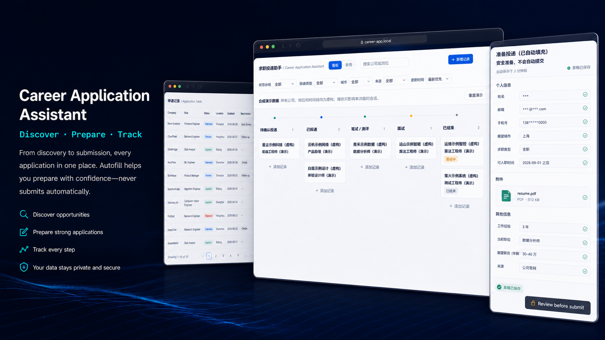
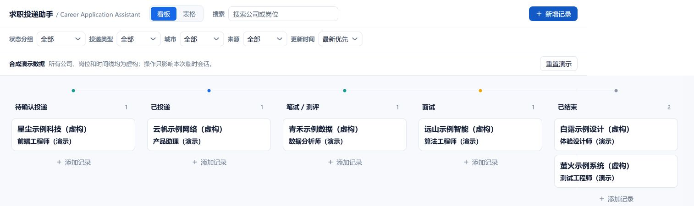
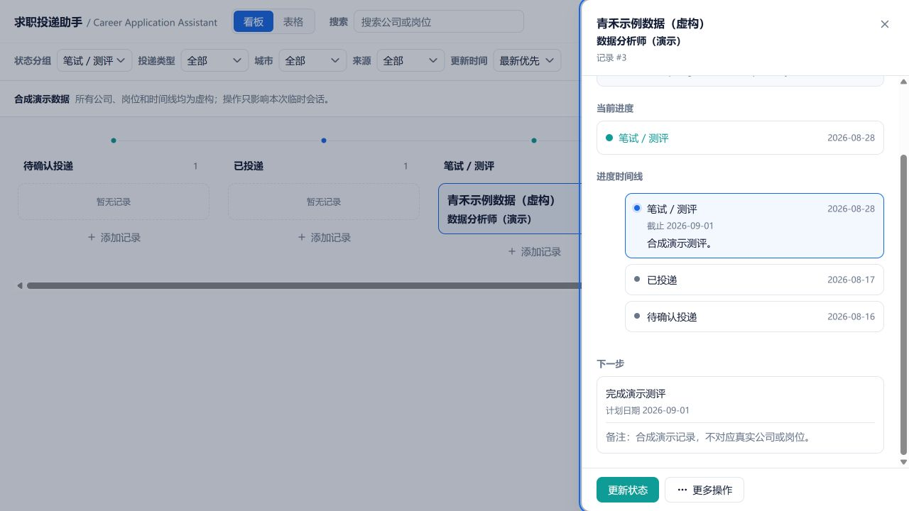

# 求职投递助手

[English](README.md) | 简体中文



求职投递助手是一套本地单用户工作流：先发现相关岗位，再把招聘申请准备到最终提交前，由你本人复核并亲自提交，最后通过结构化事件时间线持续跟踪进展。

它把四项实用能力放在一起：

1. 偏好驱动的岗位发现：Codex 在你提供的公司招聘入口内选择相关筛选范围，深入阅读岗位 JD，并用本地证据进行匹配。
2. 受约束的表单准备：Codex 只读取明确维护的本地资料文件，填写你已经在 Chrome 中打开的招聘页面，并在最终提交前停止。
3. 可持续使用的本地记录：看板和表格集中保存岗位元数据、下一步事项与经过校验的阶段事件。
4. 可选的只读邮件接入：Outlook、QQ 邮箱和 163 邮箱可以生成有界的结构化复核候选，但本项目不会变成收件箱客户端。

> [!IMPORTANT]
> `private/` 是被 Git 忽略的本地存储，不是加密保险箱。请保护工作区，检查备份与同步设置，并在公开变更前运行发布安全检查。

## 明确边界

本项目不是自动海投或批量投递工具。它不会执行最终的提交、确认、发送或申请动作，也不会自动处理登录、验证码、身份验证、付费、背景调查授权、账号创建或外部授权。页面准备完成后，必须由用户复核并亲自提交。

支持的流程保持简单：

```text
本地岗位偏好与申请资料
    -> Codex 检查相关筛选范围并深入阅读岗位 JD
    -> 用户选择岗位
    -> Codex 准备当前打开的招聘表单
    -> 用户复核并亲自提交
    -> 结构化事件更新本地时间线
    -> 通过看板和表格继续跟踪
```

表单填写、投递记录和邮件接入遵循同一规则：真实候选人资料与原始邮件内容不得成为公开仓库数据。

## 界面预览

以下截图来自隔离运行的合成 Demo。公司、岗位、日期和时间线事件均为虚构内容，不包含任何个人投递数据。



看板卡片只显示公司名和岗位名。点击卡片可以查看完整详情；投递阶段发生变化时，也可以把卡片拖到对应的列。



测评详情会显示当前阶段、截止日期、事件时间线和下一步事项。更新看板状态只用于记录进展，不能代替用户在招聘网站上的最终复核与提交。

## 体验合成 Demo

Demo 使用六条明显虚构的记录，并把数据放在隔离的系统临时目录中。它不会初始化 `private/`，不会挂载 Agent 或邮件路由，也不会调用邮箱凭据。会话结束后，所有 Demo 改动都会清除。

```powershell
pwsh -NoProfile -File .\scripts\Test-Environment.ps1 -Mode Demo
pwsh -NoProfile -File .\scripts\Start-Demo.ps1
```

打开 [http://127.0.0.1:8001](http://127.0.0.1:8001)。可以使用页面中的重置操作，也可以执行：

```powershell
pwsh -NoProfile -File .\scripts\Start-Demo.ps1 -Reset
```

Demo 启动后，可以按下面的顺序查看：

1. 浏览看板，点击任意卡片查看详情。
2. 筛选“笔试 / 测评”，打开虚构的青禾记录，查看测评时间线。
3. 点击页面中的重置操作恢复示例数据，或按 Ctrl+C 停止服务并清理当前会话目录。

Demo 服务只以前台方式运行。

## 使用本地工作区

环境要求：Windows、PowerShell 5.1 或更高版本、Python 3.12 或更高版本、[`uv`](https://docs.astral.sh/uv/) 与 [`pnpm`](https://pnpm.io/)。示例使用 PowerShell 7 提供的 `pwsh`；使用 Windows PowerShell 5.1 时，请改用 `powershell.exe`。

```powershell
pwsh -NoProfile -File .\scripts\Initialize-PrivateOverlay.ps1
uv venv .local\venv --python 3.12
$env:UV_PROJECT_ENVIRONMENT = "$PWD\.local\venv"
uv sync --locked --extra dev
pnpm --dir app\frontend install --frozen-lockfile
pnpm --dir app\frontend build
pwsh -NoProfile -File .\scripts\Test-Environment.ps1 -Mode Standard
.\.local\venv\Scripts\python.exe app\server.py
```

打开 [http://127.0.0.1:8000](http://127.0.0.1:8000)。正式服务只能使用固定的 `private/applications.sqlite`，并且只监听本机 loopback。

初始化脚本可以安全重复执行：缺失的 `private/resume_materials.md` 和 `private/job_search_preferences.md` 会分别从公开占位模板创建；任一已有文件都不会被读取或覆盖。完整安装与校验步骤见[开始使用](docs/getting-started.zh-CN.md)。

## 功能摘要

- 仓库级 `$job-discovery` Skill：根据私有岗位偏好选择招聘站内的相关筛选范围，不设置固定岗位数量上限，深入阅读可能相关的 JD，并仅依据本地证据给出匹配清单，不自动保存或投递。
- 五列看板与详细表格，支持搜索、筛选、排序、分页、响应式布局、详情、下一步事项和软删除。
- 十个精确状态以追加式、经过校验的时间线事件表示；`applied` 始终要求用户明确确认。
- 通过类型化 Agent 接口和 PowerShell 封装命令记录已准备的表单与后续状态，无需直接操作 SQLite。
- 可选的只读邮件接入：Outlook 使用 Codex Outlook Email 连接器，QQ/163 使用本机 TLS IMAP，并提供结构化人工复核队列。
- 可编辑、可重置的合成 Demo，无法访问正式数据库、Agent 路由或邮件运行时。
- 后端、前端、浏览器回归、发布策略和 Windows CI 检查均不需要真实招聘网站或邮箱账号。

## 安全摘要

- 候选人资料与投递数据只留在被忽略的本地路径；应用代码、规则、测试与占位模板才进入公开仓库。
- 正式 API 监听 `127.0.0.1:8000`，Demo 监听 `127.0.0.1:8001`；两者都不支持远程或多用户部署。
- 邮件接入只读。Outlook 连接由 Codex 管理；QQ/163 授权码使用 Windows Credential Manager，安全存储不可用时失败关闭。
- SQLite 只保存岗位元数据与有界的结构化事件，不保存简历内容、表单答案、原始邮件、附件、验证码或会议链接。
- 公开变更必须按精确路径暂存，并运行 `scripts/Test-PublicRelease.ps1 -Staged`；安全检查失败时不得绕过。

处理个人数据或开启邮件接入前，请阅读[安全与隐私](docs/security-and-privacy.zh-CN.md)。

## 文档

- [文档索引](docs/README.zh-CN.md)
- [开始使用](docs/getting-started.zh-CN.md)
- [申请工作流](docs/application-workflow.zh-CN.md)
- [邮件接入](docs/mail-ingestion.zh-CN.md)
- [安全与隐私](docs/security-and-privacy.zh-CN.md)
- [开发与 API 参考](docs/development.zh-CN.md)
- [后端目录说明](app/README.md)
- [第三方依赖声明](THIRD_PARTY_NOTICES.md)

## 贡献与路线图

请先阅读 [CONTRIBUTING.md](CONTRIBUTING.md) 与[安全策略](SECURITY.md)，并查看[路线图](ROADMAP.md)。项目会优先保障本地安全和人工最终提交边界，而不是扩大自动化范围。

## 开源许可

本项目采用 [MIT License](LICENSE) 发布。尚未发布的变更记录在 [CHANGELOG.md](CHANGELOG.md)。
